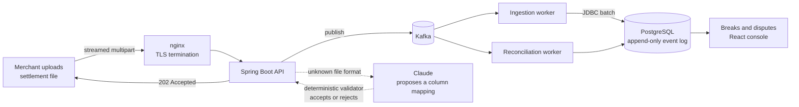

# ReconPilot

[](https://github.com/vaibhavjadhao/reconpilot/actions/workflows/ci.yml)

**A reconciliation platform that independently recomputes what a merchant
*should* have been charged, compares it against what they *were* charged, and
drives the difference to recovery.**

India's UPI MDR framework takes effect on 15 October 2026. Every merchant above
the threshold will start paying a fee that, until now, did not exist — and will
have no independent way to check it. Payment processors compute the fee, charge
the fee, and report the fee. ReconPilot is the second opinion.

One engine, two adapters:

- **MDR Guard** — verifies UPI MDR against the NPCI framework.
- **SettleSure** — verifies marketplace settlements (Amazon, Flipkart, Meesho)
  against published fee schedules.

---

## What it actually does



The rules engine has **no Spring annotations at all**. It is plain Java, so its
23 tests run in under 20 ms without starting a context — the part that decides
how much money someone is owed is the part that must be trivial to test.

## Numbers, all measured

| | |
|---|---|
| Rows ingested in one run | **1,000,000** |
| Ingest, accepted in | 0.5 s (HTTP 202; the work is queued) |
| Parsed and stored | 31 s |
| Reconciled | 6 s |
| Breaks planted / breaks found | **7,300 / 7,300 — exact** |
| Recoverable, that run | ₹133,846.00 |
| Peak heap | bounded; ingestion streams, it does not buffer |
| Tests | **119** (83 unit, 36 integration) |

Correctness was not asserted, it was checked against an **independent second
implementation**: a Python generator plants known errors and the Java engine
must find exactly those. That is how a one-paise rounding disagreement was
caught producing **8,174 false breaks** — a bug no unit test written by the
same author would have found.

## Engineering that is actually there

- **Money is `BIGINT` paise.** Never a float, never a double.
- **Append-only event log** with rebuildable projections, so the answer to
  "why were we charged this?" survives a schema change.
- **Row-level security**, enforced — a non-superuser role, `FORCE ROW LEVEL
  SECURITY`, and `WITH CHECK`. All three are required; two of them silently do
  nothing. Verified with two tenants.
- **Idempotent ingestion** via `ON CONFLICT ... RETURNING`, after a
  check-then-act race failed 12 of 14 concurrent batches.
- **Backpressure** — a bounded queue that returns 503 rather than falling over.
- **TLS** with HSTS on real certificates and deliberately off for self-signed
  ones, because a browser told `max-age=31536000` by `localhost` will not offer
  the "proceed anyway" link again for a year.
- **Backups that are proven by restoring them**, table by table and by summing
  the money on both sides. Three corrupted backups were planted; all three were
  rejected. CI runs the drill on every push.
- **AI that never touches a number a customer sees.** A model proposes a column
  mapping for an unfamiliar file; deterministic code validates it against real
  rows and decides. One call per file *format*, cached on a header fingerprint.

## Stack

Java 21 · Spring Boot 4 · PostgreSQL 17 · Kafka · Redis · React 19 + TypeScript
· Docker Compose · Flyway · Testcontainers

## Running it

```bash
cp .env.example .env          # then fill in the secrets it asks for
docker compose -p reconpilot-prod -f docker-compose.prod.yml up -d --build
open https://localhost:8443   # http://localhost:8081 redirects here
```

The default `TLS_MODE=selfsigned` generates its own certificate, so the browser
will warn on first visit — and it is right to, because nothing vouches for that
certificate. Use `TLS_MODE=provided` with a real one for a deployment, or
`TLS_MODE=off` when a load balancer in front already terminates TLS.

Prove the backups restore rather than assuming it:

```bash
docker compose -p reconpilot-prod -f docker-compose.prod.yml \
    run --rm --entrypoint /ops/restore-drill.sh backup
```

## Documentation

- [**Architecture decision records**](docs/adr/) — 18 of them, each with the
  alternative that was rejected and why
- [**Known defects**](docs/KNOWN-DEFECTS.md) — 16 recorded, 9 resolved, every
  one with a severity and a reason it is still open
- [**Open questions**](docs/OPEN-QUESTIONS.md) — the regulatory unknowns that
  gate correctness, with their primary source
- [**Deploying it**](docs/DEPLOY.md)
- [**Concepts and rebuild guide**](docs/ReconPilot-Concepts-and-Rebuild-Guide.pdf)
  — 55 pages

The defect list is public on purpose. Claim filing is **disabled by default**
because the MDR rounding rule is not yet confirmed (D7), and shipping a
reconciliation tool that files claims it cannot justify would be worse than
shipping nothing.
